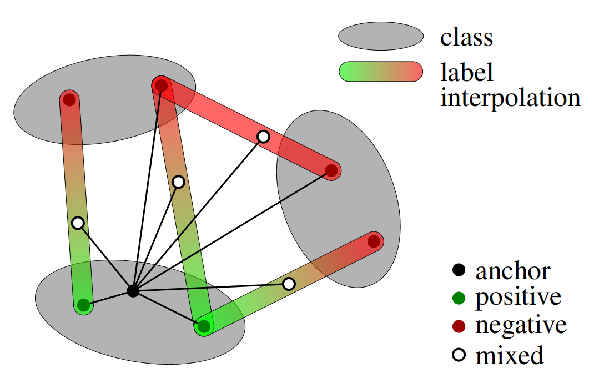

# It Takes Two to Tango: Mixup for Deep Metric Learning 

This repo contains the official PyTorch implementation and pretrained models of our ICLR 2022 paper  - **It Takes Two to Tango: Mixup for Deep Metric Learning**. [[`arXiv`](https://arxiv.org/abs/2106.04990)] [[`OpenReview`](https://openreview.net/forum?id=ZKy2X3dgPA)] [[`video`](https://iclr.cc/virtual/2022/poster/6337)] [[`slides`](.github/slides.pdf)] [[`poster`](.github/poster.pdf)]

<div align="center">
  
</div>

## Datasets
Please download: 

- [CUB](https://data.caltech.edu/records/65de6-vp158/files/CUB_200_2011.tgz?download=1)
- Cars [images](http://ai.stanford.edu/~jkrause/car196/car_ims.tgz), [annotations](http://ai.stanford.edu/~jkrause/car196/cars_annos.mat)
- [SOP](https://cvgl.stanford.edu/projects/lifted_struct/)
- [InShop](https://drive.google.com/drive/folders/0B7EVK8r0v71pVDZFQXRsMDZCX1E?resourcekey=0-4R4v6zl4CWhHTsUGOsTstw&usp=share_link)

Extract the .tgz or .zip file into the same folder, e.g. `./datasets/`. You should have a folder structure like this:

- datasets
  - CUB_200_2011
  - cars196
  - Stanford_Online_Products
  - InShop_Clothes

---
## Training
### Installation
Please install [PyTorch](https://pytorch.org/). The experiments have been performed with Python version 3.7.6, PyTorch version 1.7.0, CUDA 10.1 and torchvision 0.8.1.

The requirements are easily installed via
[Anaconda](https://www.anaconda.com/distribution/#download-section):

```bash 
conda create -n metrix python=3.7.6
conda activate metrix
conda install pytorch==1.7.0 torchvision==0.8.1 cudatoolkit=10.1 pillow==8.0.1 -c pytorch
pip install timm==0.4.12 tensorboardx==2.5.1 scikit-learn==0.23.2 munkres==1.1.4 tqdm
```

---

### Baseline Contrastive
Train baseline Contrastive with ResNet-50 for 100 epochs on CUB dataset:

```bash
python3 main.py --dataset cub --data_root /path/to/datasets/ --save_root /path/to/output/ --batch_size 100 --num_workers 4 --embedding_size 128 --num_epochs 60 --lr 1e-4 --lr_decay_gamma 0.1 --loss contrastive --mode baseline --alpha 2.0 --save_model True
```

Train baseline Contrastive with ResNet-50 for 100 epochs on Cars dataset:

```bash
python3 main.py --dataset cars --data_root /path/to/datasets/ --save_root /path/to/output/ --batch_size 100 --num_workers 4 --embedding_size 128 --num_epochs 60 --lr 1e-4 --lr_decay_gamma 0.1 --loss contrastive --mode baseline --alpha 2.0 --save_model True
```

Train baseline Contrastive with ResNet-50 for 100 epochs on SOP dataset:

```bash
python3 main.py --dataset sop --batch_size 100 --num_workers 4 --embedding_size 128 --num_epochs 60 --lr 3e-5 --lr_decay_gamma 0.25 --bn_freeze 0 --loss contrastive --images_per_class 5 --mode baseline --alpha 2.0 --save_model True
```

Train baseline Contrastive with ResNet-50 for 100 epochs on InShop dataset:

```bash
python3 main.py --dataset sop --batch_size 100 --num_workers 4 --embedding_size 128 --num_epochs 60 --lr 3e-5 --lr_decay_step 5 --lr_decay_gamma 0.25 --warm 1 --bn_freeze 0 --loss contrastive --images_per_class 5 --mode baseline --alpha 2.0 --save_model True
```

---

### Contrastive + Metrix
Train Contrastive + Metrix with ResNet-50 for 100 epochs on CUB dataset:

```bash
python3 main.py --dataset cub --data_root /path/to/datasets/ --save_root /path/to/output/ --batch_size 100 --num_workers 4 --embedding_size 128 --num_epochs 100 --lr 1e-4 --lr_decay_gamma 0.1 --loss contrastive --mode feature --alpha 2.0 --save_model True
```

Train Contrastive + Metrix with ResNet-50 for 100 epochs on Cars dataset:

```bash
python3 main.py --dataset cars --data_root /path/to/datasets/ --save_root /path/to/output/ --batch_size 100 --num_workers 4 --embedding_size 128 --num_epochs 100 --lr 1e-4 --lr_decay_gamma 0.1 --loss contrastive --mode feature --alpha 2.0 --save_model
```

Train Contrastive + Metrix with ResNet-50 for 100 epochs on SOP dataset:

```bash
python3 main.py --dataset sop --data_root /path/to/datasets/ --save_root /path/to/output/ --batch_size 100 --num_workers 4 --embedding_size 128 --num_epochs 100 --lr 3e-5 --lr_decay_gamma 0.25 --loss contrastive --images_per_class 5 --mode feature --alpha 2.0 --save_model
```

Train Contrastive + Metrix with ResNet-50 for 100 epochs on InShop dataset:

```bash
python3 main.py --dataset inshop --data_root /path/to/datasets/ --save_root /path/to/output/ --batch_size 100 --num_workers 4 --embedding_size 128 --num_epochs 100 --lr 1e-4 --lr_decay_gamma 0.25 --loss contrastive --images_per_class 5 --mode feature --alpha 2.0 --save_model
```

> For the **Contrastive + Metrix/input** or **Contrastive + Metrix/embed**, modify `--mode input` or `--mode embed` respectively.

---

### MultiSimilarity + Metrix
Train MultiSimilarity + Metrix with ResNet-50 for 100 epochs on CUB dataset:

```bash
python3 main.py --dataset cub --data_root /path/to/datasets/ --save_root /path/to/output/ --batch_size 100 --num_workers 4 --embedding_size 128 --num_epochs 100 --lr 1e-4 --lr_decay_gamma 0.5 --loss multisimilarity --mode feature --alpha 2.0 --save_model
```

> For the **MultiSimilarity + Metrix/input** or **MultiSimilarity + Metrix/embed**, modify `--mode input` or `--mode embed` respectively.

---

### ProxyAnchor + Metrix
Train Contrastive + Metrix with ResNet-50 for 100 epochs on CUB dataset:

```bash
python3 main.py --dataset cub --data_root /path/to/datasets/ --save_root /path/to/output/ --batch_size 100 --num_workers 4 --embedding_size 128 --num_epochs 100 --lr 1e-4 --lr_decay_gamma 0.5 --loss proxyanchor --mode feature --alpha 2.0 --save_model
```

> For the **ProxyAnchor + Metrix/input** or **ProxyAnchor + Metrix/embed**, modify `--mode input` or `--mode embed` respectively.

---

## Citation
If you find this repository useful, please consider giving a star :star: and citation:
```
@inproceedings{
venkataramanan2022it,
title={It Takes Two to Tango: Mixup for Deep Metric Learning},
author={Shashanka Venkataramanan and Bill Psomas and Ewa Kijak and laurent amsaleg and Konstantinos Karantzalos and Yannis Avrithis},
booktitle={International Conference on Learning Representations},
year={2022},
url={https://openreview.net/forum?id=ZKy2X3dgPA}
}
```