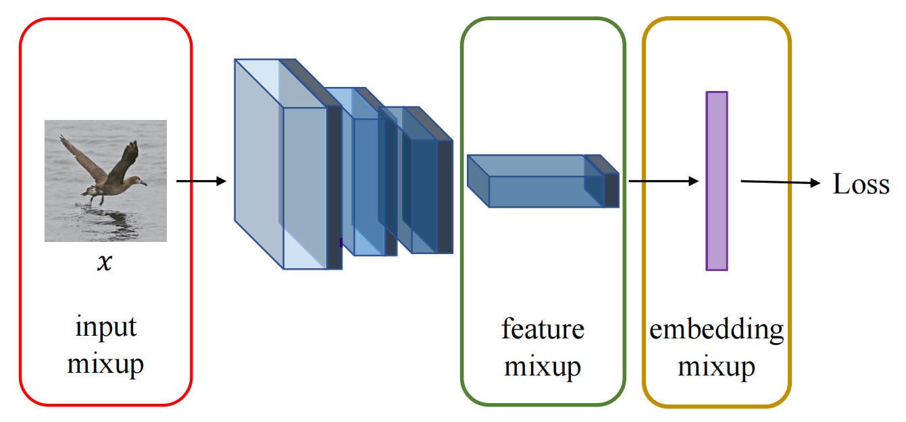

# It Takes Two to Tango: Mixup for Deep Metric Learning 

This repo contains the official PyTorch implementation and pretrained models of our ICLR 2022 paper  - **It Takes Two to Tango: Mixup for Deep Metric Learning**. [[`arXiv`](https://arxiv.org/abs/2106.04990)] [[`OpenReview`](https://openreview.net/forum?id=ZKy2X3dgPA)] [[`video`](https://iclr.cc/virtual/2022/poster/6337)] [[`slides`](.github/slides.pdf)] [[`poster`](.github/poster.pdf)]

<div align="center">
  
</div>

## Datasets
Please download: 

- [CUB](https://data.caltech.edu/records/65de6-vp158/files/CUB_200_2011.tgz?download=1)
- Cars [images](http://ai.stanford.edu/~jkrause/car196/car_ims.tgz), [annotations](http://ai.stanford.edu/~jkrause/car196/cars_annos.mat)
- [SOP](https://cvgl.stanford.edu/projects/lifted_struct/)
- [InShop](https://drive.google.com/drive/folders/0B7EVK8r0v71pVDZFQXRsMDZCX1E?resourcekey=0-4R4v6zl4CWhHTsUGOsTstw&usp=share_link)

Extract the .tgz or .zip file into the same folder, e.g. `./datasets/`. You should have a folder structure like this:

- datasets
  - CUB_200_2011
  - cars196
  - Stanford_Online_Products
  - InShop_Clothes

---
## Training
### Installation
Please install [PyTorch](https://pytorch.org/). The experiments have been performed with Python version 3.7.6, PyTorch version 1.7.0, CUDA 10.1 and torchvision 0.8.1.

The requirements are easily installed via
[Anaconda](https://www.anaconda.com/distribution/#download-section). Here we create a conda environment called `metrix` and install all the necessary libraries: 

```bash 
conda create -n metrix python=3.7.6
conda activate metrix
conda install pytorch==1.7.0 torchvision==0.8.1 cudatoolkit=10.1 pillow==8.0.1 -c pytorch
pip install timm==0.4.12 tensorboardx==2.5.1 scikit-learn==0.23.2 munkres==1.1.4 tqdm
```

---

### Baseline Contrastive
Train baseline Contrastive with ResNet-50 and an embedding size of 512 for 60 epochs on CUB dataset:

```bash
python3 main.py --dataset cub --data_root /path/to/datasets/ --save_root /path/to/output/ --batch_size 100 --num_workers 4 --embedding_size 512 --num_epochs 60 --lr 1e-4 --lr_decay_gamma 0.1 --loss contrastive --mode baseline --alpha 2.0 --save_model True
```

Train baseline Contrastive with ResNet-50 and an embedding size of 512 for 60 epochs on Cars dataset:

```bash
python3 main.py --dataset cars --data_root /path/to/datasets/ --save_root /path/to/output/ --batch_size 100 --num_workers 4 --embedding_size 512 --num_epochs 60 --lr 1e-4 --lr_decay_gamma 0.1 --loss contrastive --mode baseline --alpha 2.0 --save_model True
```

Train baseline Contrastive with ResNet-50 and an embedding size of 512 for 60 epochs on SOP dataset:

```bash
python3 main.py --dataset sop --batch_size 100 --num_workers 4 --embedding_size 512 --num_epochs 60 --lr 3e-5 --lr_decay_gamma 0.25 --bn_freeze 0 --loss contrastive --images_per_class 5 --mode baseline --alpha 2.0 --save_model True
```

Train baseline Contrastive with ResNet-50 and an embedding size of 512 for 60 epochs on InShop dataset:

```bash
python3 main.py --dataset sop --batch_size 100 --num_workers 4 --embedding_size 512 --num_epochs 60 --lr 3e-5 --lr_decay_step 5 --lr_decay_gamma 0.25 --warm 1 --bn_freeze 0 --loss contrastive --images_per_class 5 --mode baseline --alpha 2.0 --save_model True
```

Note that the argument `--mode` has been set to `baseline` here, as we are running the baseline contrastive experiments.

---

### NOTE
`Metrix`, our Mixup for Deep Metric Learning method, can be performed on `input`, `feature` or `embedding` space. In our paper, we show that Metrix on feature space performs the best. For simplification we call this `Metrix` instead of `Metrix/feature`. Metrix on input space is called `Metrix/input`, while Metrix on embedding space is called `Metrix/embed`. In general, `Metrix/input` is not computationally efficient (because the mixup takes place between images), while `Metrix/embed` is very efficient (because the mixup takes place between low-dimensional vectors).

<div align="center">
  
</div>

---

### Contrastive + Metrix
Train Contrastive + Metrix with ResNet-50 and an embedding size of 512 for 60 epochs on CUB dataset:

```bash
python3 main.py --dataset cub --data_root /path/to/datasets/ --save_root /path/to/output/ --batch_size 100 --num_workers 4 --embedding_size 512 --num_epochs 60 --lr 1e-4 --lr_decay_gamma 0.1 --loss contrastive --mode feature --alpha 2.0 --save_model True
```

Train Contrastive + Metrix with ResNet-50 and an embedding size of 512 for 60 epochs on Cars dataset:

```bash
python3 main.py --dataset cars --data_root /path/to/datasets/ --save_root /path/to/output/ --batch_size 100 --num_workers 4 --embedding_size 512 --num_epochs 60 --lr 1e-4 --lr_decay_gamma 0.1 --loss contrastive --mode feature --alpha 2.0 --save_model
```

Train Contrastive + Metrix with ResNet-50 and an embedding size of 512 for 60 epochs on SOP dataset:

```bash
python3 main.py --dataset sop --data_root /path/to/datasets/ --save_root /path/to/output/ --batch_size 100 --num_workers 4 --embedding_size 512 --num_epochs 60 --lr 3e-5 --lr_decay_gamma 0.25 --loss contrastive --images_per_class 5 --mode feature --alpha 2.0 --save_model
```

Train Contrastive + Metrix with ResNet-50 and an embedding size of 512 for 60 epochs on InShop dataset:

```bash
python3 main.py --dataset inshop --data_root /path/to/datasets/ --save_root /path/to/output/ --batch_size 100 --num_workers 4 --embedding_size 512 --num_epochs 60 --lr 1e-4 --lr_decay_gamma 0.25 --loss contrastive --images_per_class 5 --mode feature --alpha 2.0 --save_model
```

> For the **Contrastive + Metrix/input** or **Contrastive + Metrix/embed**, modify `--mode input` or `--mode embed` respectively.

Below we present the expected results per method and dataset:

<table>
  <thead>
    <tr>
      <th rowspan="2">Method</th>
      <th colspan="3" style="text-align:center;">CUB200</th>
      <th colspan="3" style="text-align:center;">CARS196</th>
      <th colspan="3" style="text-align:center;">SOP</th>
      <th colspan="3" style="text-align:center;">IN-SHOP</th>
    </tr>
    <tr>
      <th>R@1</th>
      <th>R@2</th>
      <th>R@4</th>
      <th>R@1</th>
      <th>R@2</th>
      <th>R@4</th>
      <th>R@1</th>
      <th>R@10</th>
      <th>R@100</th>
      <th>R@1</th>
      <th>R@10</th>
      <th>R@20</th>
    </tr>
  </thead>
  <tbody>
    <tr>
      <td>Baseline Contrastive</td>
      <td>64.7</td>
      <td>75.9</td>
      <td>84.6</td>
      <td>81.6</td>
      <td>88.2</td>
      <td>92.7</td>
      <td>74.9</td>
      <td>87.0</td>
      <td>93.9</td>
      <td>86.4</td>
      <td>94.7</td>
      <td>96.2</td>
    </tr>
    <tr>
      <td>Contrastive + Metrix</td>
      <td>67.4</td>
      <td>77.9</td>
      <td>85.7</td>
      <td>85.1</td>
      <td>91.1</td>
      <td>94.6</td>
      <td>77.5</td>
      <td>89.1</td>
      <td>95.5</td>
      <td>89.1</td>
      <td>95.7</td>
      <td>97.1</td>
    </tr>
    <tr>
      <td>Contrastive + Metrix/input</td>
      <td>66.3</td>
      <td>77.1</td>
      <td>85.2</td>
      <td>82.9</td>
      <td>89.3</td>
      <td>93.7</td>
      <td>75.8</td>
      <td>87.8</td>
      <td>94.6</td>
      <td>87.7</td>
      <td>95.9</td>
      <td>96.5</td>
    </tr>
    <tr>
      <td>Contrastive + Metrix/embed</td>
      <td>66.4</td>
      <td>77.6</td>
      <td>85.4</td>
      <td>83.9</td>
      <td>90.3</td>
      <td>94.1</td>
      <td>76.7</td>
      <td>88.6</td>
      <td>95.2</td>
      <td>88.4</td>
      <td>95.4</td>
      <td>95.8</td>
    </tr>
  </tbody>
</table>


---
### Baseline MultiSimilarity
Train baseline MultiSimilarity with ResNet-50 and an embedding size of 512 for 60 epochs on CUB dataset:

```bash
python3 main.py --dataset cub --data_root /path/to/datasets/ --save_root /path/to/output/ --batch_size 100 --num_workers 4 --embedding_size 512 --num_epochs 60 --lr 1e-4 --lr_decay_step 5 --lr_decay_gamma 0.5 --loss multisimilarity --mode baseline --alpha 2.0 --save_model
```

Train baseline MultiSimilarity with ResNet-50 and an embedding size of 512 for 60 epochs on Cars dataset:

```bash
python3 main.py --dataset cars --data_root /path/to/datasets/ --save_root /path/to/output/ --batch_size 100 --num_workers 4 --embedding_size 512 --num_epochs 60 --lr 1e-4 --lr_decay_step 5 --lr_decay_gamma 0.5 --loss multisimilarity --mode baseline --alpha 2.0 --save_model
```

Train baseline MultiSimilarity with ResNet-50 and an embedding size of 512 for 60 epochs on SOP dataset:

```bash
python3 main.py --dataset sop --data_root /path/to/datasets/ --save_root /path/to/output/ --batch_size 100 --num_workers 4 --embedding_size 512 --num_epochs 60 --lr 6e-4 --lr_decay_step 20 --lr_decay_gamma 0.25 --warm 1 --images_per_class 5 --bn_freeze 0 --loss multisimilarity --mode baseline --alpha 2.0 --save_model
```

Train baseline MultiSimilarity with ResNet-50 and an embedding size of 512 for 60 epochs on InShop dataset:

```bash
python3 main.py --dataset inshop --data_root /path/to/datasets/ --save_root /path/to/output/ --batch_size 100 --num_workers 4 --embedding_size 512 --num_epochs 60 --lr 6e-4 --lr_decay_step 20 --lr_decay_gamma 0.25 --warm 1 --images_per_class 5 --bn_freeze 0 --loss multisimilarity --mode baseline --alpha 2.0 --save_model
```

---
### MultiSimilarity + Metrix
Train MultiSimilarity + Metrix with ResNet-50 and an embedding size of 512 for 60 epochs on CUB dataset:

```bash
python3 main.py --dataset cub --data_root /path/to/datasets/ --save_root /path/to/output/ --batch_size 100 --num_workers 4 --embedding_size 512 --num_epochs 100 --lr 1e-4 --lr_decay_gamma 0.5 --loss multisimilarity --mode feature --alpha 2.0 --save_model
```

> For the **MultiSimilarity + Metrix/input** or **MultiSimilarity + Metrix/embed**, modify `--mode input` or `--mode embed` respectively.

> For Cars, SOP or InShop datasets, modify `--dataset cars` ,`--dataset sop` or `--dataset inshop` respectively, using the same hyperparameters as in the respective baseline experiment.

Below we present the expected results per method and dataset:

<table>
  <thead>
    <tr>
      <th rowspan="2">Method</th>
      <th colspan="3" style="text-align:center;">CUB200</th>
      <th colspan="3" style="text-align:center;">CARS196</th>
      <th colspan="3" style="text-align:center;">SOP</th>
      <th colspan="3" style="text-align:center;">IN-SHOP</th>
    </tr>
    <tr>
      <th>R@1</th>
      <th>R@2</th>
      <th>R@4</th>
      <th>R@1</th>
      <th>R@2</th>
      <th>R@4</th>
      <th>R@1</th>
      <th>R@10</th>
      <th>R@100</th>
      <th>R@1</th>
      <th>R@10</th>
      <th>R@20</th>
    </tr>
  </thead>
  <tbody>
    <tr>
      <td>Baseline MultiSimilarity</td>
      <td>67.8</td>
      <td>77.8</td>
      <td>85.6</td>
      <td>87.8</td>
      <td>92.7</td>
      <td>95.3</td>
      <td>76.9</td>
      <td>89.8</td>
      <td>95.9</td>
      <td>90.1</td>
      <td>97.6</td>
      <td>98.4</td>
    </tr>
    <tr>
      <td>MultiSimilarity + Metrix</td>
      <td>71.4</td>
      <td>80.6</td>
      <td>86.8</td>
      <td>89.6</td>
      <td>94.2</td>
      <td>96.0</td>
      <td>81.0</td>
      <td>92.0</td>
      <td>97.2</td>
      <td>92.2</td>
      <td>98.5</td>
      <td>98.6</td>
    </tr>
    <tr>
      <td>MultiSimilarity + Metrix/input</td>
      <td>69.0</td>
      <td>79.1</td>
      <td>86.0</td>
      <td>89.0</td> 
      <td>93.4</td>
      <td>96.0</td>
      <td>77.9</td>
      <td>90.6</td>
      <td>95.9</td>
      <td>91.8</td>
      <td>98.0</td>
      <td>98.9</td>
    </tr>
    <tr>
      <td>MultiSimilarity + Metrix/embed</td>
      <td>70.2</td>
      <td>80.4</td>
      <td>86.7</td>
      <td>88.8</td>
      <td>92.9</td>
      <td>95.6</td>
      <td>78.5</td>
      <td>91.3</td>
      <td>96.7</td>
      <td>91.9</td>
      <td>98.3</td>
      <td>98.7</td> 
    </tr>
  </tbody>
</table>

---
### Baseline ProxyAnchor
Train baseline ProxyAnchor with ResNet-50 and an embedding size of 512 for 60 epochs on CUB dataset:

```bash
python3 main.py --dataset cub --data_root /path/to/datasets/ --save_root /path/to/output/ --batch_size 100 --num_workers 4 --embedding_size 512 --num_epochs 60 --lr 1e-4 --lr_decay_step 5 --lr_decay_gamma 0.5 --loss proxyanchor --mode baseline --alpha 2.0 --save_model
```

Train baseline ProxyAnchor with ResNet-50 and an embedding size of 512 for 60 epochs on Cars dataset:

```bash
python3 main.py --dataset cars --data_root /path/to/datasets/ --save_root /path/to/output/ --batch_size 100 --num_workers 4 --embedding_size 512 --num_epochs 60 --lr 1e-4 --lr_decay_step 5 --lr_decay_gamma 0.5 --loss proxyanchor --mode baseline --alpha 2.0 --save_model
```

Train baseline ProxyAnchor with ResNet-50 and an embedding size of 512 for 60 epochs on SOP dataset:

```bash
python3 main.py --dataset sop --data_root /path/to/datasets/ --save_root /path/to/output/ --batch_size 100 --num_workers 4 --embedding_size 512 --num_epochs 60 --lr 6e-4 --lr_decay_step 20 --lr_decay_gamma 0.25 --warm 1 --images_per_class 5 --bn_freeze 0 --loss proxyanchor --mode baseline --alpha 2.0 --save_model
```

Train baseline ProxyAnchor with ResNet-50 and an embedding size of 512 for 60 epochs on InShop dataset:

```bash
python3 main.py --dataset inshop --data_root /path/to/datasets/ --save_root /path/to/output/ --batch_size 100 --num_workers 4 --embedding_size 512 --num_epochs 60 --lr 6e-4 --lr_decay_step 20 --lr_decay_gamma 0.25 --warm 1 --images_per_class 5 --bn_freeze 0 --loss proxyanchor --mode baseline --alpha 2.0 --save_model
```

---

### ProxyAnchor + Metrix
Train Contrastive + Metrix with ResNet-50 for 100 epochs on CUB dataset:

```bash
python3 main.py --dataset cub --data_root /path/to/datasets/ --save_root /path/to/output/ --batch_size 100 --num_workers 4 --embedding_size 512 --num_epochs 100 --lr 1e-4 --lr_decay_gamma 0.5 --loss proxyanchor --mode feature --alpha 2.0 --save_model
```

> For the **ProxyAnchor + Metrix/input** or **ProxyAnchor + Metrix/embed**, modify `--mode input` or `--mode embed` respectively.

> For Cars, SOP or InShop datasets, modify `--dataset cars` ,`--dataset sop` or `--dataset inshop` respectively, using the same hyperparameters as in the respective baseline experiment.

Below we present the expected results per method and dataset:

<table>
  <thead>
    <tr>
      <th rowspan="2">Method</th>
      <th colspan="3" style="text-align:center;">CUB200</th>
      <th colspan="3" style="text-align:center;">CARS196</th>
      <th colspan="3" style="text-align:center;">SOP</th>
      <th colspan="3" style="text-align:center;">IN-SHOP</th>
    </tr>
    <tr>
      <th>R@1</th>
      <th>R@2</th>
      <th>R@4</th>
      <th>R@1</th>
      <th>R@2</th>
      <th>R@4</th>
      <th>R@1</th>
      <th>R@10</th>
      <th>R@100</th>
      <th>R@1</th>
      <th>R@10</th>
      <th>R@20</th>
    </tr>
  </thead>
  <tbody>
    <tr>
      <td>Baseline ProxyAnchor</td>
      <td>69.5</td>
      <td>79.3</td>
      <td>87.0</td>
      <td>87.6</td>
      <td>92.3</td>
      <td>95.5</td>
      <td>79.1</td>
      <td>90.8</td>
      <td>96.2</td>
      <td>90.0</td>
      <td>97.4</td>
      <td>98.2</td>
    </tr>
    <tr>
      <td>ProxyAnchor + Metrix</td>
      <td>71.0</td>
      <td>81.8</td>
      <td>88.2</td>
      <td>89.1</td>
      <td>93.6</td>
      <td>96.7</td>
      <td>81.3</td>
      <td>91.7</td>
      <td>96.9</td>
      <td>91.9</td>
      <td>98.2</td>
      <td>98.8</td>
    </tr>
    <tr>
      <td>ProxyAnchor + Metrix/input</td>
      <td>70.5</td>
      <td>81.2</td>
      <td>87.8</td>
      <td>88.2</td> 
      <td>93.2</td>
      <td>96.2</td>
      <td>79.8</td>
      <td>91.4</td>
      <td>96.5</td>
      <td>90.9</td>
      <td>98.1</td>
      <td>98.4</td>
    </tr>
    <tr>
      <td>ProxyAnchor + Metrix/embed</td>
      <td>70.4</td>
      <td>81.1</td>
      <td>87.9</td>
      <td>88.9</td>
      <td>93.3</td>
      <td>96.4</td>
      <td>80.6</td>
      <td>91.7</td>
      <td>96.6</td>
      <td>91.6</td>
      <td>98.3</td>
      <td>98.3</td> 
    </tr>
  </tbody>
</table>

---

### Common Errors
If you face any errors, don't hesitate to open an issue. We will highlight them here.

## Acknowledgement

This repository is built using the [Proxy Anchor](https://github.com/tjddus9597/Proxy-Anchor-CVPR2020), [PyTorch Metric Learning](https://github.com/KevinMusgrave/pytorch-metric-learning) and [DML Benchmark](https://github.com/billpsomas/Deep_Metric_Learning_Pytorch).

## License
This repository is released under the MIT License as found in the [LICENSE](LICENSE) file.

## Citation
If you find this repository useful, please consider giving a star :star: and citation:
```
@inproceedings{
venkataramanan2022it,
title={It Takes Two to Tango: Mixup for Deep Metric Learning},
author={Shashanka Venkataramanan and Bill Psomas and Ewa Kijak and laurent amsaleg and Konstantinos Karantzalos and Yannis Avrithis},
booktitle={International Conference on Learning Representations},
year={2022},
url={https://openreview.net/forum?id=ZKy2X3dgPA}
}
```